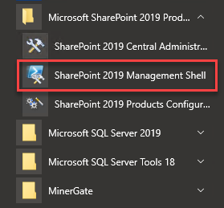

## Overview

The Sharepoint Self-Hosted plugin allows to delegate all download and uploads activities in the SharePoint User Interface to the GlassWall Rebuild engine. This keeps the all sharepoint documents safe.

## Removing File Handler V1 Plugin

To remove the File Handler, firstly we need to identify whether the application plugin has been installed on the machine or not. To identify the installation status, Open SharePoint 2019 Management Shell and run below cmdlet.

_ **Get-SPSolution** _

If the output prompt for the FilehandlerV1.wsp, it has been installed. Else we don't have any FIlehandlerV1.wsp has not been installed.

For the removal of this plugin, download 'RemoveFileHandler.PS1' from the below git location.

[https://github.com/k8-proxy/gp-sharepoint-plugins/tree/main/SelfHosted/installer](https://github.com/k8-proxy/gp-sharepoint-plugins/tree/main/SelfHosted/installer)

Once this has been downloaded in the SharePoint machine, Open SharePoint 2019 Management Shell

Locate the downloaded file through SharePoint 2019 Management Shell and run below cmdlet

'_ **.\RemoveFileHandler.PS1'

If the error 'PSSECURITYEXCEPTION' occurs, then do as below:
With PowerShell, you must ensure Get-ExecutionPolicy is not Restricted. We suggest using Bypass to bypass the policy to get things installed or AllSigned for quite a bit more security.
Run Get-ExecutionPolicy. If it returns Restricted, then run Set-ExecutionPolicy AllSigned or Set-ExecutionPolicy Bypass -Scope Process.
see [https://go.microsoft.com/fwlink/?LinkID=135170](https://go.microsoft.com/fwlink/?LinkID=135170)

Once, the cmdlet ran successfully. Validate the SharePoint Plugin running below cmdlet.

'_ **Get-SPSolution** _'

This time it should not prompt for the FileHandlerV1.wsp

