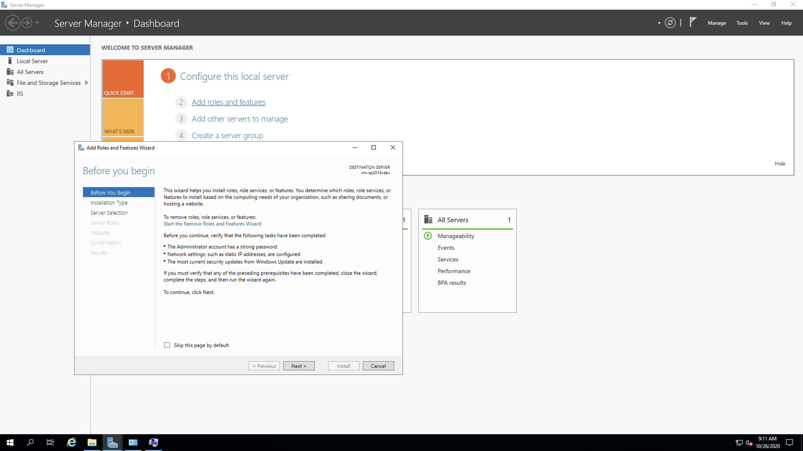
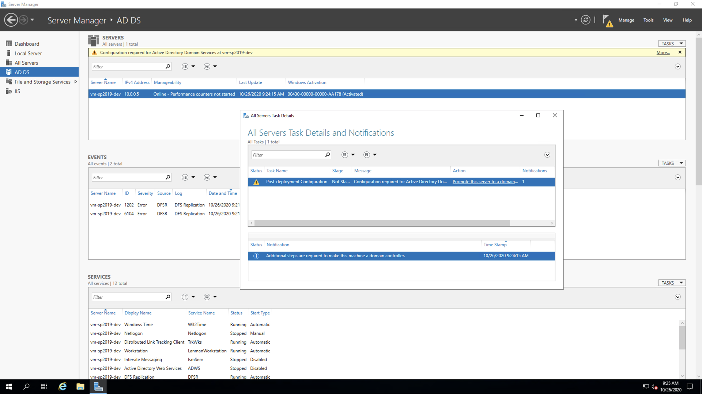
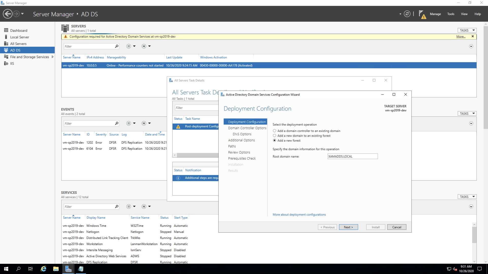
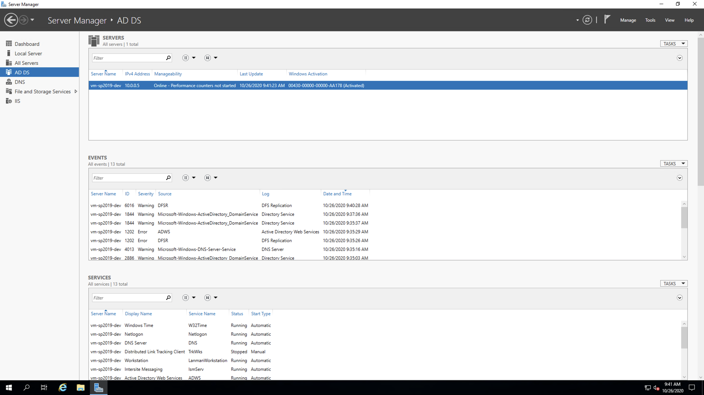
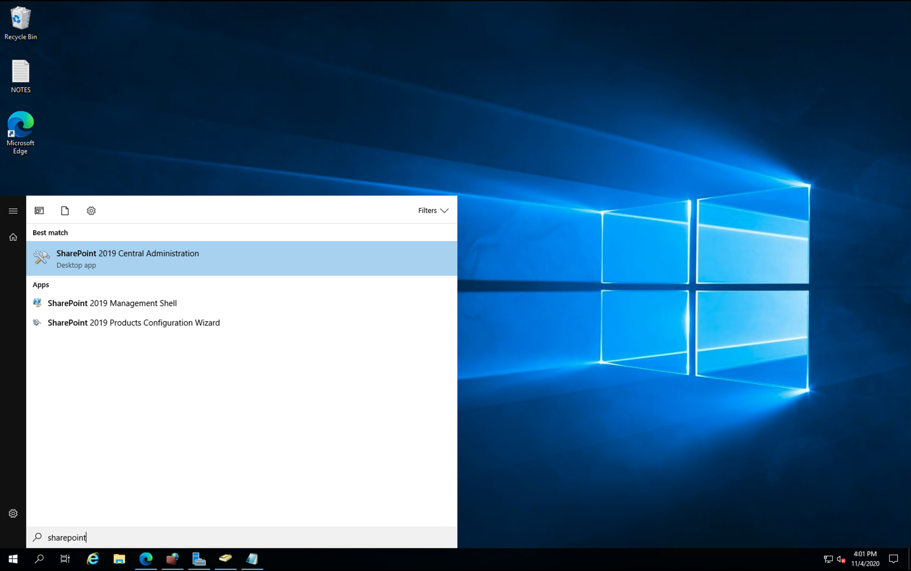

## Version: Sharepoint 2019
## Topology: Single Server Farm
## Target: Azure VM

# Steps

1. Basic System set up:

- It is recommended to go through Microsoft docs prior to installing Sharepoint Server 2019: https://docs.microsoft.com/en-us/sharepoint/install/install-sharepoint-server-2016-on-one-server

- Make sure your System is Windows Server 2016 or later, if not you need to  install Windows Server 2019 first: https://www.microsoft.com/en-us/evalcenter/evaluate-windows-server-2019

**- Microsoft SQL Server set up:**

  - Sharepoint requires Microsoft SQL Server set up in the system, you can download and install SQL Server 2017 from here: https://www.microsoft.com/en-us/evalcenter/evaluate-sql-server-2017-rtm

  - During installation, make sure to set up a User account to access the MSSQL Database instance. It is recommended to keep a note on the Database Server name and User account details for later use during Sharepoint set up. It is recommended to download and install SQL Server Management Studio as well: https://docs.microsoft.com/en-gb/sql/ssms/download-sql-server-management-studio-ssms?view=sql-server-ver15

**- Microsoft Sharepoint Server installation:**

  - You can download and install Sharepoint Server 2019 here: https://www.microsoft.com/en-us/download/details.aspx?id=57462

  - Additional reading:

    - [SharePoint Server 2019 Quick Start Guide.pdf](https://spdocs.blob.core.windows.net/preview/SharePoint%20Server%202019%20Quick%20Start%20Guide.pdf)
    - [Install SharePoint 2019 - Step by Step](https://andreasglaser.com/blog/install-sharepoint-2019)

2. Setting up Sharepoing Configurtion.

- Launch **Sharepoint Product Configuration Wizard** from start menu and attempt to set up, with the Server Database and the User account you set up in the previous step,

- If you don't have a AD Domain Services set up in your Server, then you will get the above error message. We need to set it up first before continuing Sharepoint configuration.

3. Enable Active Directory (AD) Domain Services

- We need to enable a server level feature, the AD Domain Services, in your Server. Go to **Server Manager** → Dashboard → Quick Start → Configure this local server → click on Add roles and features option and move ahead in the Wizard as follows,

- In the **Server Roles** → select **Active Directory Domain Services**

4. Promote the new Server to a Domain Controller.

- Next go to AD DS → under **SERVERS** list select the the new server

- Select under **Action** column → click on **Promote this server to a domain controller** 

- In the Deployment Configuration → select **Add a new forest** → Provide a Root domain name 

5. Configure Active Direction Domain Service.

- Provide a password to proceed ahead.

- At the end of the configuration set up the server will restart. Then after the restart there will be a long process of setting up Group Police Client, which we should wait for it to finish itself. Once all finished, you will see AD DS up and live,

6. Relaunch Sharepoint Product Configuration Wizard and finish set up.

- Let’s re-launch Sharepoint Product Configuration Wizard from Windows start menu and proceed ahead,

- You should be able to proceed ahead with the Database configuration and User account information,

- Proceed ahead with the configuration, which might take a while to complete.

- Once completed, you should be able to see **Sharepoint 2019 Central Administration** enabled in Windows start menu, which you can use to launch your Sharepoint instance as follows,

- That should lead you to Completed set up of Sharepoint 2019 in your VM.

## [NEXT 3. sp-vhd-to-ova](https://github.com/k8-proxy/k8-proxy-documentation/blob/master/docs/websites/sharepoint/server/server-setup/3.%20sp-vhd-to-ova.md)
