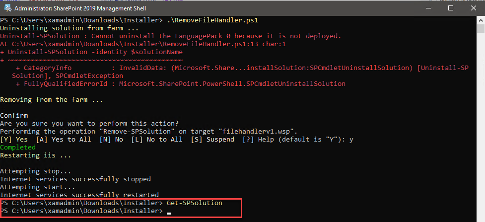

## Overview

The Sharepoint Server plugin allows to delegate all download and uploads activities in the SharePoint User Interface to the GlassWall Rebuild engine. This keeps the all sharepoint documents safe.

## Removing File Handler Plugin

1. To remove the File Handler, firstly we need to identify whether the application plugin has been installed on the machine or not. To identify the installation status, Open SharePoint 2019 Management Shell and run: `Get-SPSolution`

2. If the output prompt looks like below Glasswall.FileHandler.wsp has been installed. Else we don't have any Glasswall.FileHandler.wsp installed.

3. For the removal of this plugin open SharePoint 2019 Management Shell (as Administrator) and navigate where *RemoveFileHandler.ps1* and run the file

4. If the error 'PSSECURITYEXCEPTION' occurs, then do as below:
With PowerShell, you must ensure Get-ExecutionPolicy is not Restricted. We suggest using Bypass to bypass the policy to get things installed or AllSigned for quite a bit more secure.
Run `Get-ExecutionPolicy`. If it returns `Restricted`, then run `Set-ExecutionPolicy AllSigned` or `Set-ExecutionPolicy Bypass -Scope Process`.Click [here](https://go.microsoft.com/fwlink/?LinkID=135170) for more information.

5. Once, the cmdlet ran successfully. Validate the SharePoint Plugin running below cmdlet.

'_ **Get-SPSolution** _'

6. This time it should not prompt for the FileHandlerV1.wsp

#### Resources
- [Watch the video](../../../../static/video/docs/websites/sharepoint/server/SharePoint-Server-Installation.mp4)
